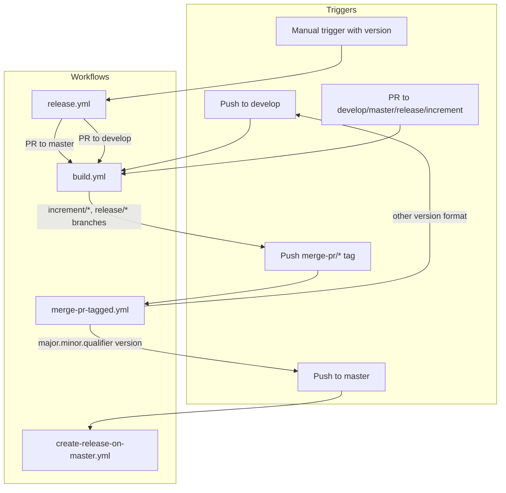
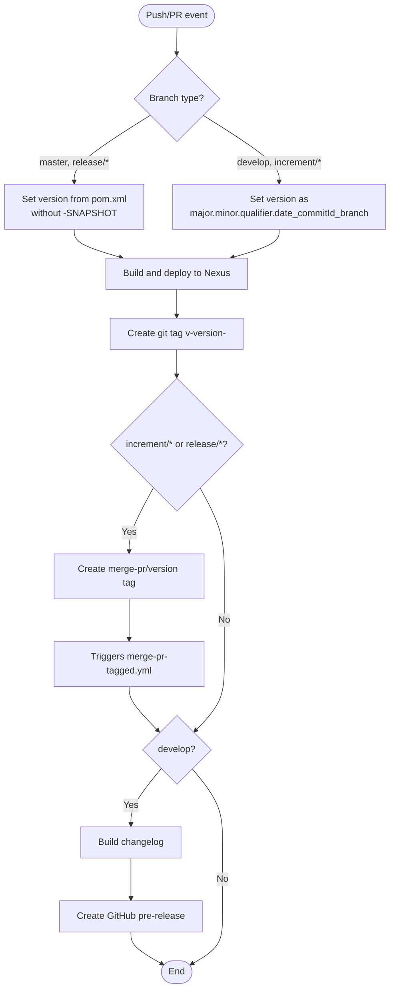
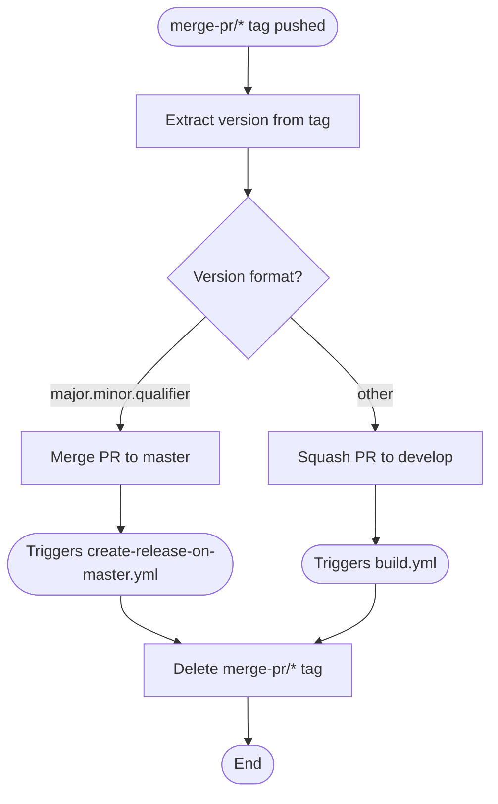
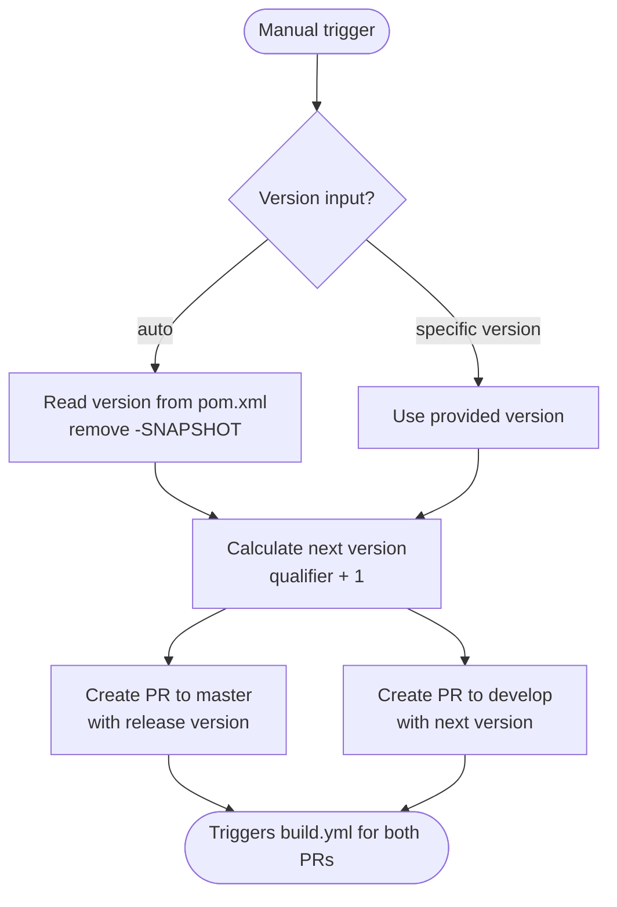

# CI/CD Flow — Development Versioning and Branch Handling

This document describes the branching strategy, versioning policy, and GitHub Actions workflows used by the karaf-features project. The workflow follows [GitFlow](https://www.atlassian.com/git/tutorials/comparing-workflows/gitflow-workflow).

## Branches

The project uses five types of branches, each with a specific role in the development and release lifecycle:

| Branch Pattern | Base | Purpose |
|----------------|------|---------|
| `develop` | — | Main development branch; contains the latest development sources |
| `feature/JNG-xxx_description` | `develop` | New features targeting the next release |
| `release/x.y.z` | `develop` | Stabilization branch for a specific release version |
| `bugfix/JNG-xxx_description` | `release/*` | Bug fixes applied during release testing (before merge to master) |
| `support/JNG-xxx_description` | `release/*` | Minor changes to a previous release; merged back to the release branch |
| `hotfix/JNG-xxx_description` | `master` | Emergency fixes applied to both master and release branches |
| `master` | — | Latest released production sources |

### Branch Flow

```mermaid
gitGraph
    commit id: "initial"
    branch develop order: 1
    commit id: "dev-1"
    branch feature/JNG-1 order: 2
    commit id: "feat-1a"
    commit id: "feat-1b"
    checkout develop
    merge feature/JNG-1 id: "merge-feat-1"
    branch feature/JNG-2 order: 3
    commit id: "feat-2a"
    checkout develop
    merge feature/JNG-2 id: "merge-feat-2"
    branch release/1.0 order: 4
    commit id: "rc-1"
    branch bugfix/JNG-3 order: 5
    commit id: "bugfix-3"
    checkout release/1.0
    merge bugfix/JNG-3 id: "merge-bugfix"
    checkout master
    merge release/1.0 id: "v1.0"
    checkout develop
    merge release/1.0 id: "back-merge"
```

## Version Numbers

Versions follow semantic versioning with specific rules per branch type:

| Event | Version Change | Example |
|-------|---------------|---------|
| Start feature branch | No change | stays `2.0.2-SNAPSHOT` |
| Start release branch | 2nd number incremented on develop | develop → `2.1.0-SNAPSHOT` |
| Start bugfix branch | No change | applied on release branch |
| Start support branch | 3rd number incremented | `1.0.1-SNAPSHOT` |
| Start hotfix branch | 4th number incremented | `1.0.0.1` |

### Build Version Format

| Branch Type | Version Format | Example |
|-------------|---------------|---------|
| `master`, `release/*` | `major.minor.qualifier` | `2.0.1` |
| `develop`, `increment/*` | `major.minor.qualifier.date_commitId_branchName` | `2.0.2.20240115_abc1234_develop` |

## GitHub Actions Workflows

The project uses several interconnected GitHub Actions workflows. The following diagram shows how they trigger each other:



### build.yml

The main build workflow that runs on every push to `develop` and on pull requests to key branches.



### merge-pr-tagged.yml

Handles automatic merging of pull requests after a successful build.



### create-release-on-master.yml

Creates an official GitHub release when code lands on master.

- Triggered by: push to `master`
- Extracts version from tag
- Builds changelog
- Creates a GitHub release (marked as latest)

### release.yml

Manually triggered workflow to initiate a release.



## Development Rules

> **Important:** There is no commit without a ticket number. Every commit and pull request must reference a JIRA ticket: `JNG-xxx`.

Issue tracking is managed in [JIRA](https://blackbelt.atlassian.net/jira/dashboards).
