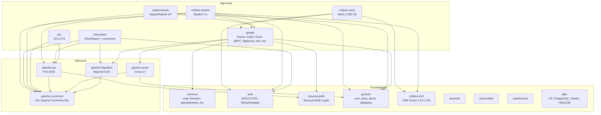
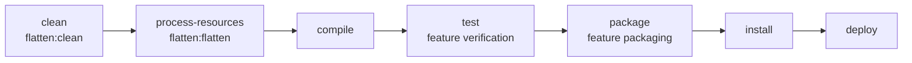

# Karaf Features

[](https://github.com/BlackBeltTechnology/karaf-features/actions/workflows/build.yml)

A collection of [Apache Karaf](https://karaf.apache.org/) OSGi feature descriptors that package 20+ third-party Java libraries for easy installation into a Karaf container. Each module produces a `feature.xml` artifact that declares the bundles, versions, and inter-feature dependencies needed to run a library in an OSGi environment.

## How It Works

Each module follows the same pattern: a `pom.xml` with `<packaging>feature</packaging>` and a single `src/main/feature/feature.xml` that lists the OSGi bundles and their Maven coordinates. The [karaf-maven-plugin](https://karaf.apache.org/manual/latest/#_maven) generates and validates the final feature descriptor at build time against Karaf 4.4.7.

To consume a feature, add its repository to your own `features.xml`:

```xml
<repository>mvn:hu.blackbelt.karaf.features/karaf-features-google/${version}/xml/features</repository>
```

Then reference the specific feature by name (e.g., `guava-33`, `jackson-core`, `jdbc-postgresql`).

## Module Dependency Overview

The following diagram shows how feature modules depend on each other at build/runtime:



## Feature Modules

### Foundational (no cross-module dependencies)

| Module | Key Features | Description |
|--------|-------------|-------------|
| `karaf-features-common` | javax-mail, threeten, opentelemetry, brotli4j, perfmark, re2j | Utility libraries used by higher-level features |
| `karaf-features-antlr` | antlr2, antlr3, antlr4, stringtemplate3 | ANTLR parser generator versions |
| `karaf-features-bouncycastle` | bouncycastle (1.69–1.81) | BouncyCastle cryptography library |
| `karaf-features-jackson` | jackson-core, jackson-jaxrs, jackson-jaxws, jackson-datatypes | Jackson JSON processing (version ${jackson-version}) |
| `karaf-features-eclipse-emf` | eclipse-emf (2.12–2.39) | Eclipse Modeling Framework |
| `karaf-features-javassist` | javassist (3.29.2-GA) | Java bytecode manipulation |
| `karaf-features-tinybundles` | tinybundles (3.0.0) | OSGi bundle creation utility |
| `karaf-features-subethamail` | subethamail (3.1.7) | Embedded SMTP server |
| `karaf-features-jdbc` | jdbc-h2, jdbc-postgresql, jdbc-oracle, jdbc-hsqldb | JDBC database drivers |

### Mid-level

| Module | Key Features | Depends On |
|--------|-------------|------------|
| `karaf-features-apache-commons` | 30+ Apache Commons libraries (beanutils, codec, collections, compress, io, lang3, etc.) | Internal cross-references only |
| `karaf-features-apache-httpclient` | apache-httpclient3, apache-httpclient4 | apache-commons |
| `karaf-features-apache-arrow` | apache-arrow (17.0.0) | apache-commons, jackson |
| `karaf-features-apache-poi` | apache-poi3/4/5 | bouncycastle, apache-commons |

### High-level

| Module | Key Features | Depends On |
|--------|-------------|------------|
| `karaf-features-google` | guava (18–33), guice (4/5/7), gson, Google API client, gRPC, BigQuery, Ads | common, apache-httpclient, jackson, bouncycastle, apache-arrow |
| `karaf-features-jxls` | jxls2, jxls3 | apache-commons, apache-poi |
| `karaf-features-jasperreports` | jasperreports6, jasperreports7 | jackson, apache-commons, google |
| `karaf-features-xdocreport` | xdocreport-core, docx/odt converters, template engines | apache-commons, apache-httpclient, apache-poi, antlr |
| `karaf-features-eclipse-epsilon` | eclipse-epsilon-2 (2.5.0) | jackson, google, antlr, apache-commons, apache-poi, eclipse-emf |
| `karaf-features-eclipse-xtext` | eclipse-xtext (2.29/2.39) | eclipse-emf, google, antlr |

> **Note:** `karaf-features-openapi-generator` exists in the repository but is currently commented out in the parent POM modules list.

## Build Commands

```bash
# Full build with feature validation (requires JDK 21)
./mvnw clean install

# Build a single module
./mvnw -pl karaf-features-jackson clean install

# Skip all modules (parent POM only)
./mvnw -DskipModules=true clean install
```

## Build Lifecycle



The **flatten-maven-plugin** runs during `process-resources` to resolve the CI-friendly `${revision}` property. The **karaf-maven-plugin** validates feature descriptors during `test` and packages them during `package`.

## Maven Profiles

| Profile | Purpose |
|---------|---------|
| `modules` | Activates all 19 feature modules (default, unless `-DskipModules=true`) |
| `sign-artifacts` | GPG signs artifacts for release |
| `release-central` | Deploys to Maven Central via Sonatype OSSRH |
| `release-judong` | Deploys to JUDO Nexus repository |
| `generate-github-asciidoc-diagrams` | Generates PNG diagrams from CI flow docs |
| `update-source-code-license` | Updates Apache 2.0 license headers |

## Contributing

See [CONTRIBUTING.md](CONTRIBUTING.md) for setup instructions and submission guidelines.

## License

This project is licensed under the [Apache License 2.0](http://www.apache.org/licenses/LICENSE-2.0).
